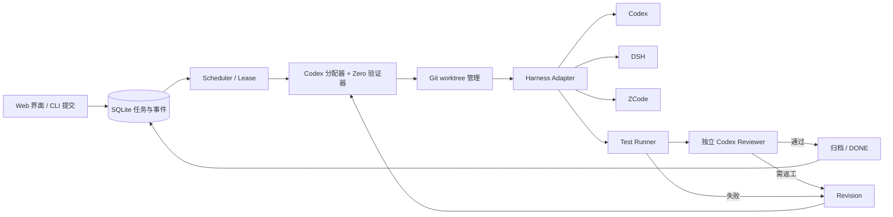

# Zero v1 架构决策与实施方案

核查日期：2026-09-24。本文区分已由项目官方仓库核实的能力与 Zero 的设计判断。上游功能、CLI 参数及许可证应在实施时锁定具体版本再复核。

**接入路径更新：**用户现有 ZCode 桌面配置位于 ZCode 自己的 v2 数据根，并已配置 GLM 和 DeepSeek。早期设计的 Zero 独立 `.zcode/cli/config.json` 绑定仅是可选隔离 CLI 路径，不能代表这台电脑正在使用的桌面模型配置。当前优先研究 ZCode `app-server` 的会话级模型选择；[共享工作区与跨 Harness 接力设计](workspace-handoff-design.md)记录新的实施边界。Zero 不移动或改写现有 ZCode 配置/凭据。

## 结论

Zero v1 做成**一个独立安装的应用**：后台服务负责无人值守执行，同一服务提供本地 Web 界面，CLI 提供脚本入口。核心使用 Node.js 24 + TypeScript、SQLite、Git worktree 和 Codex、DSH、ZCode Harness Adapter；界面采用 React 并作为静态资源随服务打包。**不直接 fork 参考仓库。** 其中 Hydra 是最接近需求的流程参考，CAO 提供清晰的多 CLI Provider/会话抽象，Agent Orchestrator 提供已落地的同任务切换实例；这些项目可继续作为运行时与交接设计参考，但不担任 Zero 的任务状态源。

这个判断针对当前 Windows 节点和 Zero 的交付标准：每项任务必须经过可追溯的路由、独立工作区、机器测试、Codex 独立审核、有限返工和持久归档。Zero 自己维护状态机，避免把某个 Agent 的自然语言“已完成”当成 DONE。按用户最新决定，**Codex 固定担任分配器和 Reviewer**；用户可在 Zero 中手动指定执行 Harness、模型和思考强度，未指定的字段由 Codex 在可用候选中选择。

## 参考项目核查

| 项目 | 架构与可借鉴处（已核实） | 许可证（已核实） | 对 Zero 的判断 |
|---|---|---|---|
| [AWS CLI Agent Orchestrator](https://github.com/awslabs/cli-agent-orchestrator) | Python 服务、SQLite/event bus、Supervisor/Worker、Provider 抽象、tmux 终端、profile 的 provider/model、headless/HTTP/Web UI；现有 workflow journal 与 `use_worktree` 能力。见 [架构](https://github.com/awslabs/cli-agent-orchestrator/blob/main/CODEBASE.md)、[profile](https://github.com/awslabs/cli-agent-orchestrator/blob/main/docs/agent-profile.md)、[workflow](https://github.com/awslabs/cli-agent-orchestrator/blob/main/docs/workflows.md)、[发布记录](https://github.com/awslabs/cli-agent-orchestrator/releases)。 | [Apache-2.0](https://github.com/awslabs/cli-agent-orchestrator/blob/main/LICENSE) | Provider 设计最值得参考；依赖 POSIX/tmux，且其会话/工作流不等于 Zero 的完整任务交付状态机。当前 Windows 节点不选为直接底座。 |
| [Agent Orchestrator](https://github.com/Untrivial-ai/agent-orchestrator) | 多 coding-agent、每任务 workspace/worktree、PR/CI/review 与看板；覆盖面较广。 | [Apache-2.0](https://github.com/Untrivial-ai/agent-orchestrator/blob/main/LICENSE) | 参考 workspace 与可观测性；直接采用将引入超出 v1 的桌面和 PR 平台。 |
| [Hydra](https://github.com/krowxx/hydra) | 本地 daemon、共享队列、headless worker、角色/agent/model 配置、心跳恢复、worktree、cross-model verification、Windows 启动方式。见 [架构](https://github.com/krowxx/hydra/blob/master/docs/ARCHITECTURE.md)、[配置](https://github.com/krowxx/hydra/blob/master/docs/USAGE.md)。 | [MIT](https://github.com/krowxx/hydra/blob/master/LICENSE) | 功能形态最接近；但交互 console、council、nightly/evolve 等扩大代码面，且 agent/model 配置耦合在现有产品结构。适合作流程参考，不直接 fork。 |
| [multi-agent-cli-orchestrator](https://github.com/Atman36/multi-agent-cli-orchestrator) | Python/FastAPI、文件队列、后台 runner、步骤报告、超时与重试、安全开关。 | README 显示 MIT badge；仓库根目录未核实到 LICENSE 条款文件。 | 轻量 worker 思路可借鉴。直接复制代码前须澄清许可；双层路由及 Git worktree 仍需补齐。 |
| [codex-orchestrator](https://github.com/zm2231/codex-orchestrator) | HTTP/SSE、SQLite、workflow DAG、Implementer→Reviewer→QA→返工、worktree。 | 仓库根目录未见许可证文件，README 未声明。 | 借鉴返工状态与 QA 门禁；不直接复用代码。 |
| [DeepSeek Harness](https://github.com/deepseek-ai/deepseek-harness) | Cordis 插件架构；已检查 `@deepseek-ai/dsh@0.1.5-rc.2` 的 Windows CLI：headless 接受一次 positional task，stdout 输出最终回答，reasoning 写入 stderr；该版本不提供 `--json`。`--dump-config` 可打印组合 profile 配置。 | [MIT](https://github.com/deepseek-ai/deepseek-harness/blob/master/LICENSE) | 作为候选 Harness 接入。当前只探测隔离 `DSH_HOME` 下的 headless CLI，不暴露模型或思考强度 binding，直到 Zero 能验证有效 profile 配置与目标模型一致。 |
| [Codex + DSH Delegation](https://github.com/LomoMao/delegate-to-deepseek-harness) | Codex Skill 与 wrapper；任务 brief、指定 cwd、独立验证和工作区范围检查。见 [Skill](https://github.com/LomoMao/delegate-to-deepseek-harness/blob/master/SKILL.md)。 | [MIT](https://github.com/LomoMao/delegate-to-deepseek-harness/blob/master/LICENSE) | 借鉴执行契约与验证器；不是调度系统。 |
| [ZCode（Z.ai 官方）](https://github.com/zai-org/ZCode) | Agent CLI 支持 headless prompt、cwd、执行模式和 NDJSON，见[参数源码](https://github.com/zai-org/ZCode/blob/main/apps/zcode-cli/packages/cli/src/arguments.ts)。本机官方源码隔离构建的 v0.16.9 已通过版本/帮助探测，尚未作模型调用。进一步只读源码审查发现 `app-server --stdio` 的 `session/create` 接受 `model: {providerId, modelId}` 和 `thoughtLevel`；模型选择写入该会话状态，不调用全局默认模型配置写入器。用户现有桌面配置已登记 GLM 与 DeepSeek。 | [Apache-2.0](https://github.com/zai-org/ZCode/blob/main/LICENSE)；[NOTICE](https://github.com/zai-org/ZCode/blob/main/NOTICE.md) 限定第一方范围。 | 优先用会话协议接入现有桌面提供方，不改写其配置/凭据；真实调用、取消、状态隔离和思考等级仍需在任务 worktree 中验证。早期独立 CLI 配置绑定保留为可选隔离模式，不用于推断用户桌面配置。 |
| [Super Plumber](https://github.com/LUKAWI/super-plumber) | TypeScript 的任务依赖图、状态、checkpoint、交接报告；提供 CLI、MCP 与 Web UI，YAML/Git 为图数据来源。 | [MIT](https://github.com/LUKAWI/super-plumber/blob/main/LICENSE) | 可作为未来的可选任务规划/可视化模块；不代替 Zero 的 SQLite 执行状态、Harness 路由或额度恢复。详见[单独评估](super-plumber-assessment.md)。 |

**底座判断：**若必须从现有代码库直接 fork，Hydra 的需求覆盖较高且许可证清楚；但 Zero v1 需要更小、更可证明的状态与能力边界。CAO 即使已有 model override、workflow journal 和 worktree，当前机器仍需要额外 Linux/WSL/tmux 环境，且 Zero 仍要实现自己的交付状态机。Agent Orchestrator 在 Windows 可运行并已支持 Codex/Claude 同任务切换，但其现成切换范围不包含用户当前重点使用的 ZCode，且直接采用会引入更广的桌面、PR/CI 产品结构。故保留 Zero 独立核心，吸收两者已验证的工作区和交接机制；如果其 ZCode 能力或运行边界发生变化，再按真实适配成本复核。这个结论是架构判断，不是对项目质量的排名。

## Zero v1 边界与交付语义

- 单机、单用户、可信任务来源；支持多个仓库，任务在独立 Git worktree 中运行。
- Web 界面负责提交任务、查看队列/日志/审核意见/报告、取消任务；CLI 提供相同的脚本能力。后台服务独立于界面进程，在界面关闭后继续工作。界面只监听本机地址；远程访问应通过明确配置和身份验证开放。
- DONE 只表示：执行进程正常结束、改动范围检查通过、所需测试全绿、独立 reviewer 通过、成果已提交到任务分支且归档成功。报告记录 base commit、结果 commit 与完整 diff（含运行中新增文件）。是否自动合并或推送目标仓库由独立策略控制。
- worktree 是 Git 隔离，不是系统安全沙箱。无人值守上线时须让 Agent/测试在专用低权限账户或隔离容器中运行，凭据按运行阶段最小化注入；若隔离环境不可用，不能宣称可以安全执行不可信仓库。

## 模块与数据流



DB 是状态权威；原始日志和 diff 保存为文件，DB 只保存路径、哈希、摘要及状态事件。Scheduler 使用原子领取、lease/heartbeat 和进程重启恢复；同一任务的活跃 attempt 只能有一个。所有外部副作用有 task_id、attempt_id 和幂等标识。作业进程异常退出后先检查 worktree 与产物，再从安全边界恢复；不盲目重跑已完成的外部步骤。

### 状态机

```text
pending → running → reviewing → done
             │           │
             └──→ revision ←──┘
                    │
                    └──→ running
running / reviewing → waiting（模型额度）→ running（到期自动领取）
任一阶段超过预算或发生不可恢复错误 → failed
```

`max_revisions = N` 表示 **首次执行 + 最多 N 次内容返工**。CLI/网络暂时性故障重试单独计数，不消耗内容返工次数；测试失败和 reviewer 的 `changes_requested` 都会生成明确的返工 brief。每次返工后重新运行全部必需门禁。`failed` 保存工作树与证据以便人工诊断。

显式模型使用额度耗尽时，Zero 保存当前阶段、worktree 指纹、路由/检查证据和下次尝试时间，释放 lease；后台服务到期后在同一 worktree 继续，额度等待不计入内容返工。以供应商明确的重置时间为准；无可信时间时从短间隔逐步退避，最长每 6 小时重新探测一次，因周额度也可能耗尽而不设置固定 5 小时或固定总尝试次数。普通认证、网络、超时、账单问题不归类为可自动恢复的额度暂停。断电发生在活跃外部命令中时仍按未知副作用故障关闭，不能无条件重放。

## 统一 Harness Adapter

```text
probe() -> HarnessCapabilities
prepare(run_context, model_binding) -> Invocation
run(invocation, on_event, deadline) -> RunResult
cancel(run_id) -> CancelResult
normalize(raw_output) -> RunResult
```

`RunContext` 至少含 task_id、attempt_id、role（implement/review/revise）、cwd、base commit、任务 brief、允许的文件范围、预算与所需输出格式。`RunResult` 含状态、退出码、结构化 final、事件流路径、stdout/stderr 路径、请求及实际模型、Harness 版本、耗时、session id（若可用）。Adapter 用 argv 数组启动独立子进程，设置 cwd、受控环境、超时，并终止完整进程树；日志流量有上限且对凭据脱敏。**退出码 0 只证明 Harness 回合完成，不能证明任务成功。**

- Codex：采用官方 [OpenAI Docs 的 `codex exec` 无交互模式](https://learn.chatgpt.com/docs/non-interactive-mode)，用 JSONL 事件及显式模型与 sandbox 配置；review 阶段只读。
- DSH：已核实 `@deepseek-ai/dsh@0.1.5-rc.2` 的 Windows headless CLI 形式为 `dsh --profile <name> <task...>`；headless 模板帮助展示 task 为位置参数，未发现 stdin 输入契约，也不支持 `--json`。stdout 是最终文本，reasoning 输出到 stderr，因此 Adapter 不把 stdout 当作 JSONL。实测 `--dump-config` 中 `agent-default-model` 为 `provider: deepseek-official`、`model: deepseek-flash`。Zero 将 `DSH_HOME` 固定到自己的数据目录；probe 和执行前均比对命名 profile 的有效 provider/model 与已验证绑定，并按 CLI 版本固定。`zero verify-binding dsh <model-id> --profile <name>` 会在隔离目录进行最小真实调用，成功后才登记绑定。DSH 不会因 CLI 可运行就被 Router 选中；当前本机尚未通过 DSH 真实模型调用，也没有可路由的 DSH 绑定。Windows npm 安装的 `.cmd` 启动器不能直接用于无 shell 子进程；可用 `ZERO_DSH_ENTRY` 指向绝对 JavaScript 入口，由 Node 启动。
- ZCode：当前已发布的 headless adapter 使用 Zero 独立数据根和 `.zcode/cli/config.json`，属于可选隔离模式，不能直接接入用户在 ZCode 桌面界面配置的 GLM/DeepSeek。面向这台电脑的新接入方向是官方 `app-server --stdio` 协议：创建独立任务会话时传入准确的 `providerId/modelId`，工作目录指向任务 worktree，并按该会话选择模型。只读源码核对表明选择会写会话局部状态，不修改全局模型默认配置；仍需真实协议测试确认。`thoughtLevel` 有协议字段，但每个模型支持哪些等级仍需验证，未经验证不得显示为已生效的思考强度。不得复制、移动、修改用户现有 ZCode 配置或凭据。

## Harness 与 Model 解耦

配置分四层，密钥只以 secret reference 表示，绝不写入公开 Git 仓库：

```yaml
harnesses:
  codex: {adapter: codex_exec, command: codex}
  dsh: {adapter: dsh_headless, command: dsh}
  zcode: {adapter: zcode_headless, command: zcode}
models:
  gpt_primary: {provider: openai, model_id: "<经环境验证的 GPT ID>"}
  deepseek_primary: {provider: deepseek, model_id: "<经环境验证的 DeepSeek ID>"}
  glm_primary: {provider: zai, model_id: "<经环境验证的 GLM ID>"}
bindings:
  - {harness: codex, model: gpt_primary, selector: cli_argument}
  - {harness: dsh, model: deepseek_primary, selector: profile, profile: headless-deepseek}
  - {harness: dsh, model: glm_primary, selector: profile, profile: headless-glm}
  - {harness: zcode, model: glm_primary, selector: session_protocol}
  - {harness: zcode, model: deepseek_primary, selector: session_protocol}
```

`models` 记录模型能力、上下文上限、成本/配额元数据（若已核实）；`bindings` 才代表 Harness **实际可调用** 某模型。每个 binding 需要 `probe` 证明 CLI 版本、认证、模型选择和最小调用通过。无法确认 profile 选择的模型时将其置为 `unavailable`；若 CLI 在成功调用中不报告实际模型，报告以 `selector_only` 标明证据范围。若 DSH/ZCode 的配置只能修改全局状态，则先做运行级隔离或串行化，不允许并发任务互相改写默认模型。DSH 和 ZCode 当前的 per-run reasoning effort 不可验证，因此不展示为可选能力。配置快照及有效模型写入报告。

## Codex 分配器与双层路由

1. Zero 先枚举通过 probe 的 `(Harness, Model)` binding，并按操作系统、权限、headless、配额、上下文和阶段能力过滤，得到**实际可运行的候选表**。
2. 独立的 Codex 分配会话读取任务 brief、仓库摘要、测试要求和候选表，输出结构化的任务类型、复杂度、推荐 Harness、推荐 Model、理由及备用路线。它只能从候选表中选择，不能发明模型 ID 或调用不存在的 CLI。
3. 用户可在 Zero 界面为执行阶段独立选择 `Harness`、`Model`、`Reasoning Effort`，任一项都允许留空。选择优先级为任务指定 > 项目预设 > 全局预设 > Codex 分配。Codex 只能补全未指定字段；指定 Harness 时仅列出其已验证模型，指定模型时仅列出兼容 Harness。思考强度映射到 Harness 的实际参数或配置，未验证支持的档位不能显示为可选。
4. Zero 验证 Codex 的输出与用户配置，固定 route decision：`(harness_id, model_id, reasoning_effort, binding_id, config_hash, reason, selection_source)`。执行期间不静默切换模型或思考强度；替换路线产生明确事件和新的 attempt/基础设施重试。
5. Review 固定用**新的 Codex 会话**，只读访问 base→head diff、测试证据与验收条件，输出可解析 verdict 和逐项 finding。Reviewer 的模型与思考强度也可在 Zero 中配置；默认尽量与执行模型不同。如果执行阶段也是 Codex 且模型相同，至少强制独立会话、只读权限与机器测试门禁，并在报告中标明审核独立性降低。

Codex 做语义判断，Zero 做约束验证和状态推进。质量、速度与费用的优劣需用 Zero 自己的任务集测量，不能仅根据模型品牌硬编码。分配器失败、输出无效或候选为空时不猜测路线，任务留有诊断记录。

首批 Codex 分配提示可采用用户给出的偏好：复杂开发倾向 ZCode+GLM，长上下文任务倾向 ZCode+DeepSeek，调试/测试倾向 Codex+GPT，独立第二方案倾向 DSH+DeepSeek。**这些是待实测的建议**，只对通过模型绑定冒烟测试的组合生效。每次选择保留候选及排除原因，以便以后用任务完成率、返工率和耗时调整。

## 测试、Review 和报告

- 每个仓库有 allowlist 的检查清单（如 pytest、npm build/test、colcon test）；自动探测只生成建议，最终执行列表应在任务启动前冻结。命令按 argv 执行，逐项记录退出码、持续时间、日志和覆盖范围。无测试命令且任务要求验证时，不能 DONE。
- Codex Reviewer 必须依据 diff、验收条件与测试结果给出 `pass | changes_requested | blocked`。`changes_requested` 提供文件/行、严重度、证据和修复要求；无法解析或中途失败视为审核未完成。Reviewer 仅提出意见，不改代码；返工由 Zero 再调度执行 Harness。
- 执行报告保存：任务 brief、route 决策、版本及配置哈希、每次 attempt、Git base/head、diff/改动清单、测试结果、review findings、返工原因、日志路径、最终状态。日志应脱敏并设置留存上限。

## 实施顺序与验收门槛

1. **环境与仓库**：建立 Zero 的 Git 仓库与公开 GitHub 仓库，Zero 原创代码采用 Apache-2.0；建立忽略规则、密钥扫描、CI。逐个验证 Codex、DSH、ZCode 在目标机器上的 CLI 版本、认证、模型绑定和无头任务。2026-09-24 已发布公开仓库、配置隐私检查和 CI；Codex 已通过一次真实的分配→执行→检查→审核→归档任务。DSH 已隔离安装并完成无模型请求的 CLI 版本、headless 帮助及配置检查；它仍缺少认证和模型调用证据。ZCode 已从官方源码隔离构建 v0.16.9 并通过版本/帮助探测，模型锁定和认证调用仍待验证。Windows 开机启动和退出登录后的真实运行也尚未验收。
2. **状态核心**：SQLite schema、task/event/attempt、原子领取、lease/恢复、HTTP API 与 CLI submit/status/cancel；用假 Adapter 证明掉电重启后不丢任务、不重复 DONE。
3. **工作区与测试**：worktree 创建/保留/清理、范围检查、测试执行器、进程超时与日志归档；证明并行任务互不影响。
4. **三个 Harness Adapter**：先实现 Codex，再接 DSH 和 ZCode；每个 binding 通过真实冒烟测试才进入 Router 候选。原始事件与标准结果均存档。
5. **Codex 分配器与 Reviewer**：实现候选过滤、Codex 结构化分配、用户模型覆盖、route 快照、Codex 独立只读 review、结构化 verdict。验证 reviewer 不会写工作区。
6. **返工闭环**：测试或审核失败后生成 revision brief；达到 `max_revisions` 准确 FAILED；通过后重跑门禁再 DONE。
7. **应用界面与无人值守部署**：同一服务托管 React 界面，提供提交、状态看板、任务详情、日志与报告下载；做成单一安装体验。后台进程开机自启，使用专用低权限执行环境、健康检查、磁盘/配额上限、凭据注入与故障恢复；完成一次完整真实仓库任务的端到端演练，公开发布文档和版本。

每个阶段由主负责人定义验收标准和审查结果；具体实现及部分验证交给 `gpt-6-luna high` 子 agent。主负责人保留架构、底座选择、集成审查和发布判断。

### v1 放行用例

- 手动指定 Harness、模型、思考强度时，Codex 分配器不能改写这三项；只填其中一项时，它只补全其余字段，并且 Zero 校验组合确实可运行。
- 三项都留空时，Codex 分配器给出结构化选择与理由；无健康 binding、无有效模型或输出无效时任务失败并留下诊断，不会静默使用 CLI 默认值。
- 实施为 Codex、DSH 或 ZCode 时，审核始终启动**另一个只读 Codex 会话**；测试红灯、审核未完成或 verdict 为 `changes_requested` 时不能 DONE。
- `max_revisions=0` 时首次失败直接 FAILED；`max_revisions=2` 时最多执行三轮。断电或 worker 重启不会产生重复提交、重复报告或丢失任务。
- 同一仓库两项任务同时运行时各自 worktree 与模型配置互不覆盖；任务成功后可从报告定位结果分支、commit、diff、测试和审核证据。

## 可推翻本方案的观察

最关键的是**模型选择能否按任务被强制执行**：如果 ZCode 会话协议或 DSH profile 无法在本机稳定运行指定模型，对应 binding 必须停用，不能通过修改用户桌面全局默认值伪装成双层路由。若目标节点改为稳定 Linux/WSL 环境，且 CAO 的 DSH/ZCode Provider 实测能提供可靠完成事件、隔离工作树和输出，重新评估将 CAO 作为 Zero 的运行时后端。当前没有对这些付费模型执行实机任务，质量排序保持待测。
